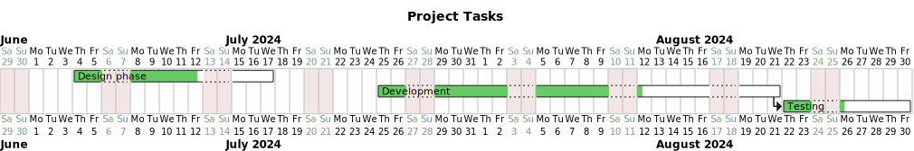

TaskTracker
===========

TaskTracker.jl is a Julia package that helps you track and visualize your tasks from a todo file. It parses a markdown file, calculates the completion percentage of each task, and generates a Gantt chart using PlantUML.

Usage
-----

To use TaskTracker, follow these steps:

1. Install the package by typing `]add https://github.com/kavir1698/TaskTracker.jl` in Julia.
2. Create a todo file in markdown format (e.g., `todo.md`) with the following syntax:
   - Tasks start with `- [ ]` or `- [x]` for incomplete or complete tasks, respectively.
   - Tasks can have subtasks indented with two spaces.
   - Tasks can have a start date and duration in days specified in the format `Task name | yyyy-mm-dd | duration`.
3. Run `julia -e 'using TaskTracker; generate_gantt("todo.md"; output_file="gannt.svg")'` in the terminal, replacing `todo.md` with your todo file name if necessary.
4. A Gantt chart will be generated as `gantt.svg` in the same directory.
5. If you have multiple todo files in a directory, you can generate a combined Gantt chart for all of them by running `julia -e 'using TaskTracker; generate_gantt_for_dir("path/to/directory"; output_file="combined_gantt.png")'` in the terminal, replacing `path/to/directory` with your directory path if necessary.
6. The combined Gantt chart will be generated as `combined_gantt.png` in the same directory.

7. You can export in the following formats: `pdf`, `png`, `svg`,`xml`, and `plain` (for text). But a combined chart can only be in `png` format.
 
Example Todo File
----------------

See `example/todo.md` for an example todo file.
